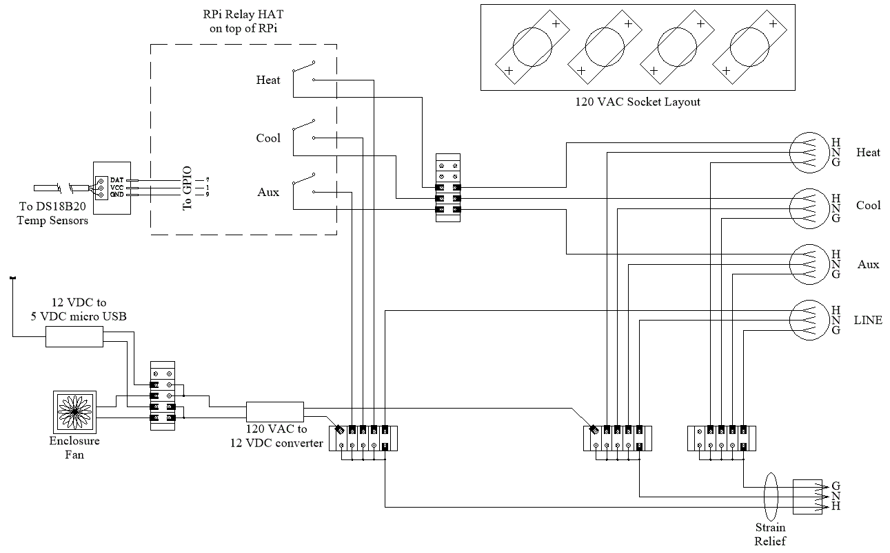

## 💻 FermVault Project

The **FermVault app** monitors the temperature of a fermenting product (beer, wine, mead, etc.) inside a refrigerator or freezer. The app turns the appliance on or off, and optionally a heater on or off, to maintain a consistent fermentation temperature. The temperature of the fermenting product can be used as the control point. PID regulation ensures accurate temperature control with very little or no overshoot or undershoot of the setpoint temperature. Robust email notifications allow flexible remote monitoring. A "command" integration via email allows remote email control of the FermVault system.

Currently tested only on the Raspberry Pi3B and Pi4 running Trixie and Bookworm. Should work with RPi5 running the same OS's but not yet tested.

Please **donate $$** if you use the app. See "Support the app" under the Settings & Info menu.

There is also a **KegLevel Monitor** project in the repository. The KegLevel Monitor allows homebrewers to monitor and track the level of beer in their kegs. Up to 10 kegs are supported. Robust email notifications allow flexible remote monitoring.

🔗 [KegLevel Project](https://github.com/keglevelmonitor/keglevel)

## To Install the FermVault App

Open **Terminal** and run this command. Type carefully and use proper uppercase / lowercase because it matters:

```bash
bash <(curl -sL https://bit.ly/fermvault)
```

That's it! You will now find "Fermentation Vault" in your application menu under **Other**. You can use the "Check for Updates" action inside the app to install future updates.

## 🔗 Detailed installation instructions

Refer to the detailed installation instructions for specific hardware requirements and a complete wiring & hookup instructions:

👉 (placeholder for installation instructions)

## ⚙️ Summary hardware requirements

Required
👉 (placeholder for summary hardware requirements) 

## ⚙️ Hardware Requirements

For the complete list of required hardware, part numbers, and purchasing links, please see the detailed hardware list:

➡️ **[View Detailed Hardware List](assets/hardware.md)**

## ⚡ Quick Wiring Diagram

Here is a quick wiring diagram showing the logical connections of the system's components:


## To uninstall the FermVault app

Selections within the uninstall script allow you to:
* uninstall only the app, leaving the settings folder intact (APP)
    this is useful if you wish to reinstall the app but retain settings
    (deletes ~/fermvault contents and all of its subfolders)
    (deletes the desktop shortcut from the Other launch menu)
* uninstall the app and all of its settings (ALL)
    (deletes everything above)
    (deletes ~/fermvault-data contents)
* exit without doing anything

To uninstall, open **Terminal** and run this command. Type carefully and use proper uppercase / lowercase because it matters:

```bash
bash <(curl -sL https://bit.ly/uninstall-fermvault)
```

## ⚙️ For reference

Installed file structure:
```
~/fermvault/
├── .gitignore
├── fermvault.desktop
├── install.sh
├── LICENSE
├── README.md
├── requirements.txt
├── setup.sh
├── uninstall.sh
├── update.sh
│
├── src/
│   ├── api_manager.py
│   ├── brewersfriend.api.py
│   ├── fg_calculator.py
│   ├── main.py
│   ├── messages.py
│   ├── notification_manager.py
│   ├── popup_manager.py
│   ├── relay_control.py
│   ├── settings_manager.py
│   ├── temperature_controller.py
│   ├── ui_manager.py
│   ├── ui_manager_base.py
│   │
│   └── assets/
│        ├── help.txt
│        ├── changelog.txt
│        ├── fermenter.png
│        ├── relay_led.gif
│        ├── support.gif
│        └── wiring.gif
│
├── venv/
│   ├── (installed dependencies)
│   ├── requests
│   ├── rpi-lgpio
│   ├── pytz
│
~/fermvault-data/
    ├── fermentation_data.json
    ├── fermvault_settings.json
    └── pid_tuning_log.csv
    
System-level dependencies installed via sudo apt outside of venv:
sudo apt-get install -y python3-tk python3-dev swig python3-venv liblgpio-dev
```


